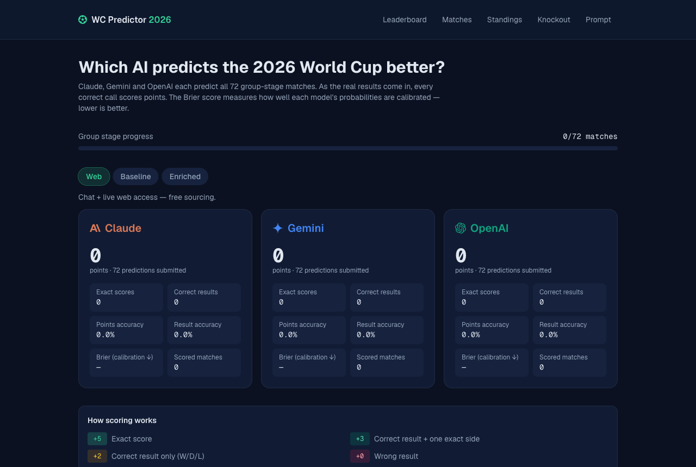
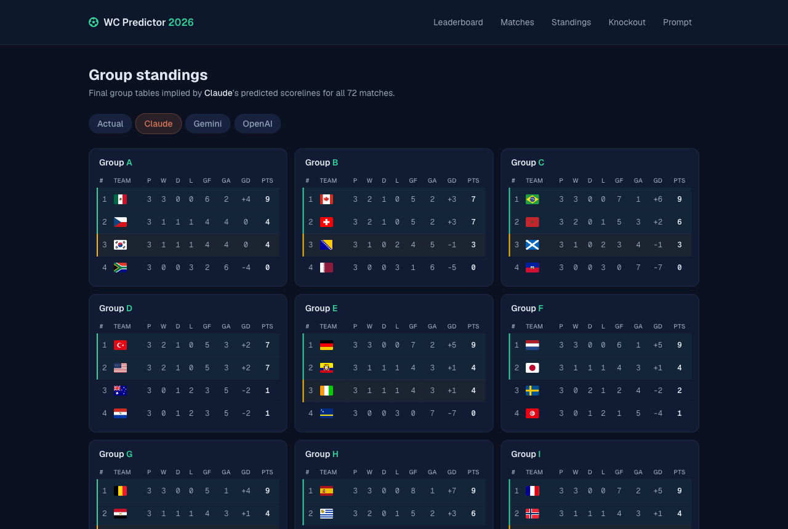
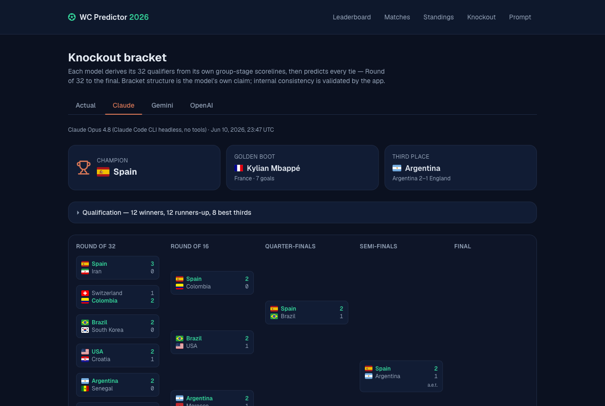
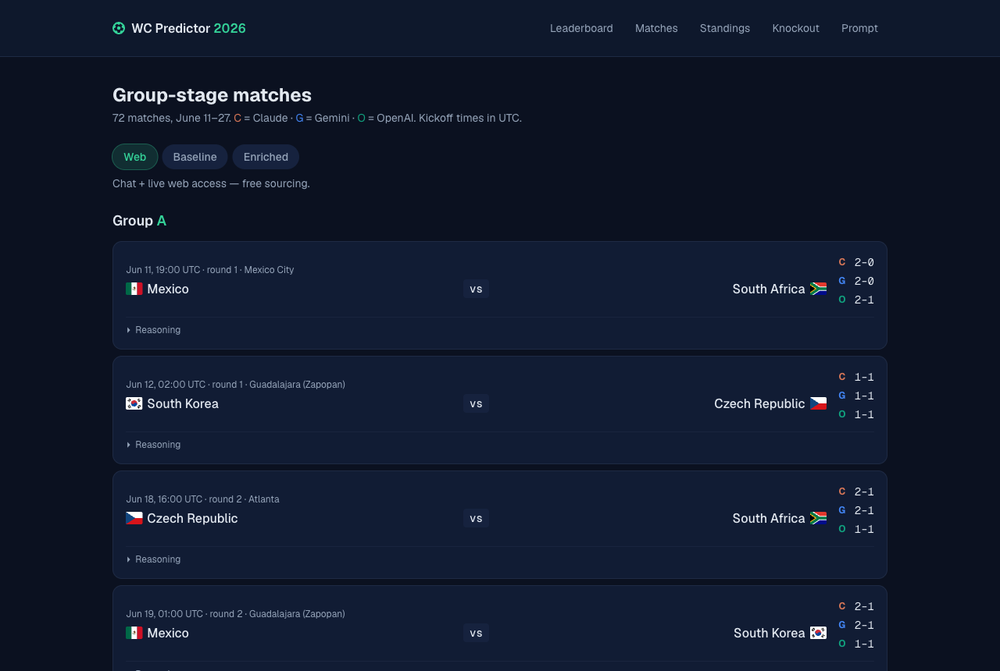

# World Cup Predictor 2026 — Claude vs Gemini vs OpenAI

An open, academic-style experiment: **which frontier LLM predicts the 2026 FIFA World Cup
better — and how much of that skill is the model itself vs the data you hand it?**

Claude (Anthropic), Gemini (Google) and GPT (OpenAI) predict all 72 group-stage matches
and the full knockout bracket. As real results come in, every prediction is scored
(pool points + Brier calibration). All prompts, raw model outputs, runner scripts and the
standardized dataset are versioned in this repository.

**Live:** https://worldcup2026.willianpinho.com · by [Willian Pinho](https://willianpinho.com)



| Predicted standings                                                                | Predicted knockout bracket                                                   |
| ---------------------------------------------------------------------------------- | ---------------------------------------------------------------------------- |
|  |  |



## Experiment design

Each model runs under three conditions (_arms_), isolating where the predictive skill
comes from:

| Arm          | How                                              | What it measures                                           |
| ------------ | ------------------------------------------------ | ---------------------------------------------------------- |
| **web**      | Chat/CLI with live web access                    | Model + free-form web sourcing (uncontrolled sources)      |
| **baseline** | API call, no tools, no extra context             | Pure parametric knowledge inside the model                 |
| **enriched** | API call, no tools, + standardized context block | Reasoning over controlled data — identical for every model |

The enriched arm answers a real methodological problem: with free web access, models may
hallucinate stats or cite different sources, confounding the comparison. The standardized
block ([`docs/context/team-context.json`](docs/context/team-context.json)) snapshots one
dataset for all models: FIFA/Coca-Cola Men's Ranking (official API, 2026-04-01 release) +
World Football Elo Ratings (eloratings.net, retrieved 2026-06-10) + confederation, for
all 48 teams.

**Models:** Claude Opus 4.8 · GPT-5.2 · Gemini 3.1 Pro (Preview).

### Knockout stage

Each model also predicts the complete knockout bracket — Round of 32 through the final —
**chained on its own group-stage scorelines** ([`docs/PROMPT-KNOCKOUT.md`](docs/PROMPT-KNOCKOUT.md)):
it derives its group standings, picks the 32 qualifiers (12 winners + 12 runners-up +
8 best thirds), builds the bracket, predicts every knockout match (extra time and
penalties included), and names a champion + Golden Boot. The app validates internal
consistency (winners match scores, each round is a perfect matching of the previous
round's winners, champion = final winner); the bracket pairing itself is the model's
claim — knowing the official format is part of the test.

### Methodological notes & limitations

- **API arms receive the fixture list** (the web arm had to recall the official draw) —
  the API arms test judgement on outcomes, not memory of the schedule.
- API calls are made **per group** (12 calls × 6 matches) for output reliability, via a
  [LiteLLM](https://github.com/BerriAI/litellm) gateway, JSON-validated with retry on
  schema errors. No tool use, no system prompt, temperature at provider default.
- Gemini's runs go through the Gemini CLI (OAuth) because of API credit limits; the CLI
  reports per-call tool stats and the runner **verifies zero tool calls** per request on
  the no-tools arms.
- Group tiebreakers are simplified (points → GD → GF → head-to-head among tied teams →
  alphabetical); fair-play points and drawing of lots are not reproducible from scorelines.
- Predictions were locked before the tournament: group-stage web runs on 2026-06-09,
  everything else on 2026-06-10 — kickoff is 2026-06-11.
- **Future work:** player-level predictions (scorers, cards) scored against match event
  data; knockout brackets for the baseline/enriched arms.

## Scoring

Pool points per match: exact score **5** · correct result + one exact side **3** ·
correct result only **2** · wrong **0**. Calibration: multiclass **Brier score** over the
win/draw/win probabilities (lower = better) — it rewards honest probabilities, not loud
guesses.

## Pages

- `/` — leaderboard per arm (points, accuracy, exact scores, Brier).
- `/matches` — all 72 fixtures, flags, per-model predictions, results, points.
- `/standings` — FIFA-style group tables: actual vs the final tables implied by each
  model's predicted scorelines, with qualification cutoffs (top 2 + best 8 thirds).
- `/knockout` — the **actual** bracket (official placeholders that fill in as the
  tournament progresses) plus each model's predicted bracket to the champion, with
  Golden Boot pick.
- `/prompt` — every prompt variant and every raw model run, verbatim.
- `/admin` — import runs, sync results, manual override (token-gated).

## Stack

Next.js 16 (App Router) · React 19 · Prisma 7 + SQLite (libSQL) · Tailwind 4 ·
TypeScript · vitest. Runs on a single VPS behind Traefik; results sync from
openfootball / API-Football every 30 minutes.

## Reproduce a run

```bash
pnpm install
cp .env.example .env          # set ADMIN_TOKEN / CRON_SECRET
pnpm prisma migrate deploy && pnpm db:seed
pnpm dev                      # http://localhost:3000

# group stage, enriched arm, via a LiteLLM gateway
LITELLM_API_KEY=... pnpm tsx scripts/run-model.ts \
  --model claude --engine "Claude Opus 4.8" --litellm-model wc/claude \
  --condition enriched --context docs/context/team-context.json

# knockout bracket chained on a group-stage run
LITELLM_API_KEY=... pnpm tsx scripts/run-knockout.ts \
  --model claude --engine "Claude Opus 4.8" --litellm-model wc/claude \
  --input docs/runs/claude-2026-06-09.json
```

Run files land in `docs/runs/` and are registered in `src/lib/runs.ts` /
`src/lib/knockout/runs.ts`; the seed imports them automatically.

## Data

- **Fixtures (seed):** [openfootball/worldcup.json](https://github.com/openfootball/worldcup.json) — public, no API key.
- **Results (sync):** API-Football when `FOOTBALL_API_KEY` is set; otherwise openfootball.
  Manual override in `/admin` covers any gap.
- **Standardized context:** see [`docs/context/README.md`](docs/context/README.md)
  (sources + snapshot dates).

## Deploy (VPS + Traefik + Cloudflare)

Subdomain `worldcup2026.willianpinho.com`, TLS via origin cert (no certresolver).
Secrets via 1Password:

```bash
op run --env-file=.env.template -- docker compose up -d --build
```

SQLite persists in the `wc_db` volume (`/app/data`). A cron sidecar calls
`/api/results/sync` every 30 minutes.

---

An independent project by [Willian Pinho](https://willianpinho.com) — not affiliated
with, or endorsed by, Anthropic, Google, or OpenAI.
